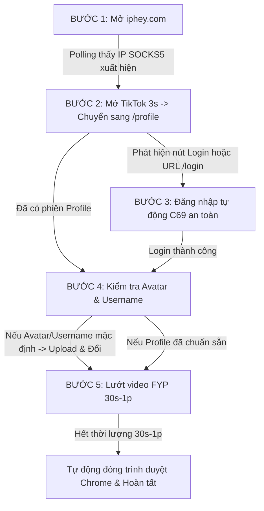

# KẾ HOẠCH THIẾT KẾ KỸ THUẬT (AGENT 1 - PLANNER)

- **Mục tiêu:** 
  Tái cấu trúc pipeline theo cơ chế **Element-Driven State Transition (Kiểm tra phần tử DOM để chuyển bước)** theo đúng kiến trúc anh Tony chỉ đạo:
  1. Kiểm tra IP đã đổi sang SOCKS5 trên `iphey.com` -> Ngay khi phần tử IP xuất hiện -> Chuyển sang TikTok.
  2. Vào TikTok vài giây -> Mở link kiểm tra trang Profile (`https://www.tiktok.com/profile`).
  3. Kiểm tra phần tử: Nếu cần login -> Tự động login (bảo vệ an toàn zero raw exception, loại bỏ hoàn toàn `.unwrap()` gây crash).
  4. Sau khi login: Kiểm tra phần tử Avatar & Username -> Nếu mặc định thì upload avatar và đổi username.
  5. Sau khi profile chuẩn -> Chuyển sang FYP lướt video 30s-1 phút rồi tự động tắt trình duyệt.
- **Ngày lập:** 2026-09-20
- **Nhánh triển khai:** `feature/tiktok-element-driven-pipeline`
- **Người thực hiện:** Agent 1 (Planner)

---

## 1. Phân tích nguyên nhân lỗi crash và timeout khi SOCKS5 chậm

### 1.1. Nguyên nhân Crash
- Trong `browser_nurture.rs`, dòng 721 có lệnh: `let acc = c69_acc.as_ref().unwrap();`.
- Khi proxy SOCKS5 chậm hoặc mạng chập chờn, API C69 có thể timeout hoặc profile chỉ lưu username rác mà chưa fetch được account object. Khi rơi vào luồng login, lệnh `unwrap()` gây **PANIC trực tiếp trên luồng worker và làm CRASH toàn bộ ứng dụng Rust**!
- Khắc phục: Thay thế triệt để `unwrap()` bằng `match` / `if let` an toàn tuyệt đối.

### 1.2. Nguyên nhân Treo / Không chuyển bước khi SOCKS5 chậm
- Khi SOCKS5 chậm, `Page.navigate` hoặc `evaluate` với timeout 8s bị ngắt giữa chừng vì trang `iphey.com` tải nhiều script nặng.
- Thay vì chờ trang tải hết 100% tài nguyên dư thừa, áp dụng **Element-Driven Polling**:
  Chỉ cần phần tử mục tiêu (Target DOM Element) xuất hiện trên trang là chuyển ngay sang bước tiếp theo!

---

## 2. Thiết kế luồng Element-Driven chi tiết 5 Bước

### Chi tiết các bước:
1. **Bước 1 (Check IP):**
   - Mở `https://iphey.com`.
   - Polling mỗi 1.5s tìm sự xuất hiện của chuỗi IP proxy trong DOM.
   - Thấy IP -> Ghi log thành công -> Chuyển ngay sang Bước 2!
2. **Bước 2 (Vào TikTok & Mở /profile):**
   - Mở `https://www.tiktok.com`, chờ 3s.
   - Chuyển sang `https://www.tiktok.com/profile`.
3. **Bước 3 (Xử lý Login):**
   - Polling kiểm tra: Nếu URL chuyển về `/login` hoặc có nút `top-login-button`:
     * Lấy user & pass từ C69 (không `unwrap()`). Nếu không có pass -> Dừng an toàn và đóng trình duyệt.
     * Tự động điền và submit form login, giải quyết OTP/Rate limit.
4. **Bước 4 (Cập nhật Profile):**
   - Kiểm tra ảnh avatar: Nếu mặc định -> Mở Edit profile -> Dùng CDP `upload_file_to_input` đưa avatar chân dung tự nhiên vào -> Apply.
   - Kiểm tra username: Nếu dạng `user\d+` -> Đổi sang username sạch (bỏ tiền tố `3_`).
5. **Bước 5 (Lướt FYP):**
   - Mở `https://www.tiktok.com/foryou?lang=en`.
   - Lướt video và tương tác (Like, Comment, Share) 35s - 55s.
   - Kết thúc -> Tự động đóng trình duyệt và giải phóng slot!

---

## 3. Tiêu chí nghiệm thu (Acceptance Criteria)
1. Tuyệt đối không crash khi SOCKS5 chậm hoặc khi thiếu thông tin tài khoản (Zero panic, no unwrap).
2. Tăng timeout CDP lên 20s.
3. Chuyển bước dựa trên sự xuất hiện của phần tử DOM thay vì chờ trang tải hết.
4. Hoàn thành trọn vẹn chu trình từ Check IP -> TikTok -> Login -> Avatar/Username -> FYP 30s-1p -> Đóng Chrome.
